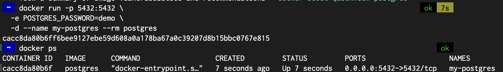
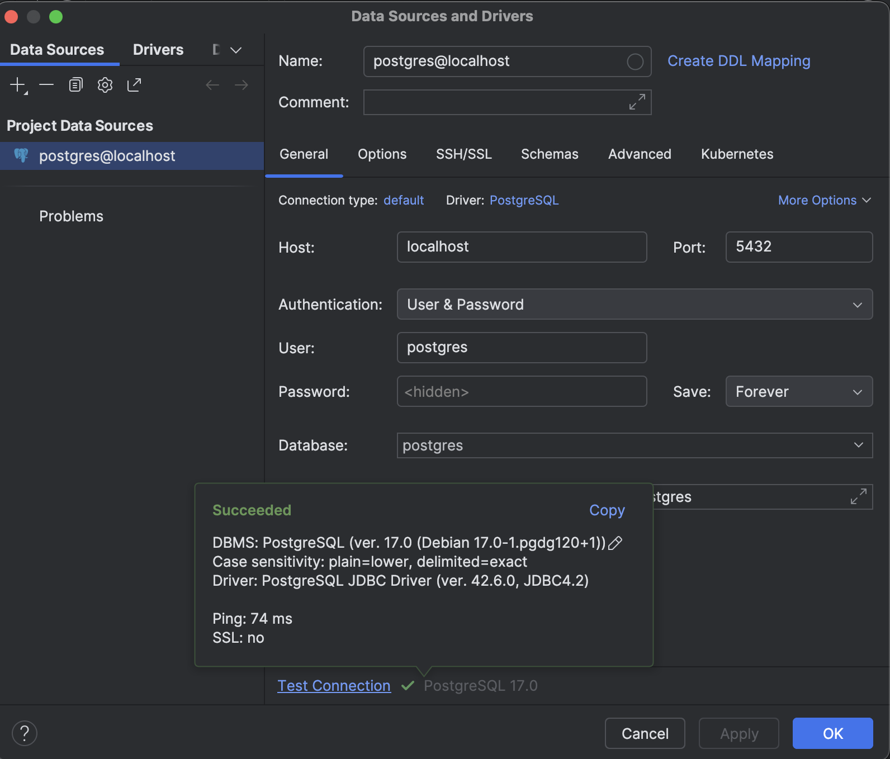
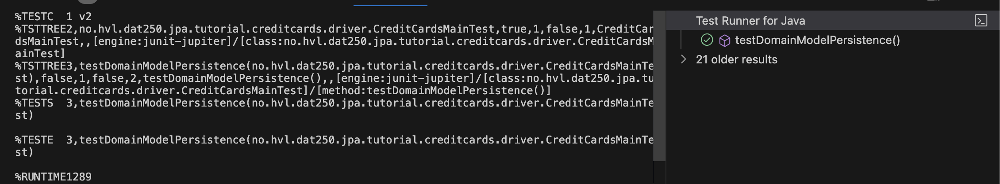
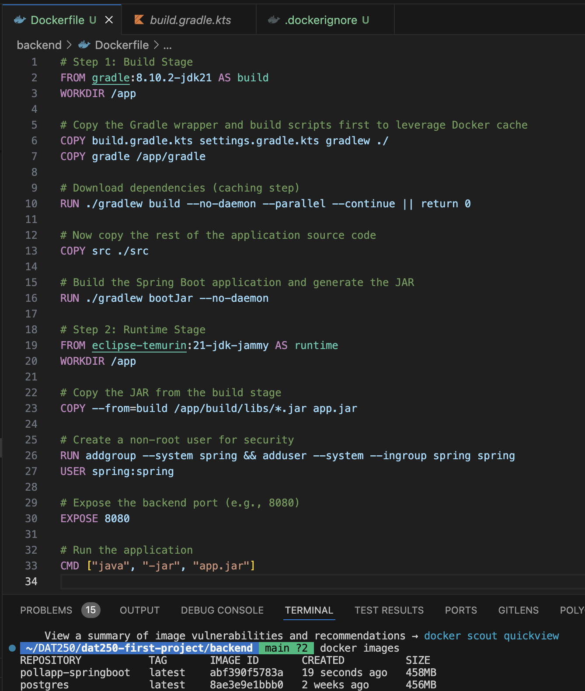

## First Exercise: Can you find out what -p and -e arguments you have to pass to the docker run command?

- The default port for PostgreSQL is 5432, therefore i expose this port.
- I need to set the env variable POSTGRES_PASSWORD

I run the command:

```
docker run -p 5432:5432 \
  -e POSTGRES_PASSWORD=demo \
  -d --name my-postgres --rm postgres
```



Testing connection using intellij


### Running the tests

After updating the `persistance.xml` and `build` file i applied the tables manually using Intellij. I did experience some issues here: I tried running the tests using Intellij, before doing any changes to the codebase. Meaning i used the original code from expass 4, when the tests were successful. This didnt work. However, the tests were running successfully on vscode. Therefore I choose only to use the DB tooling on Intellij, and do further improvements, and code changes regarding the expass 7 tasks, in the vscode editor. This worked.


## Building my own dockerized application.

- Wrote the Dockerfile
  
- Created the image with the command `docker build -t pollapp-springboot .`
- Checking that the image exists (see the terminal logs in the attached image/picture)
